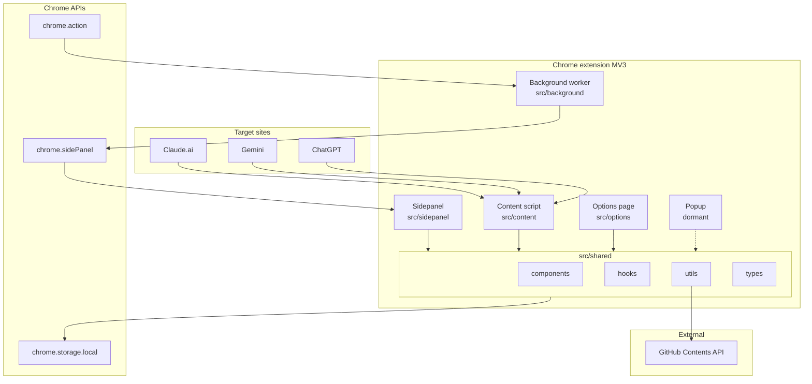
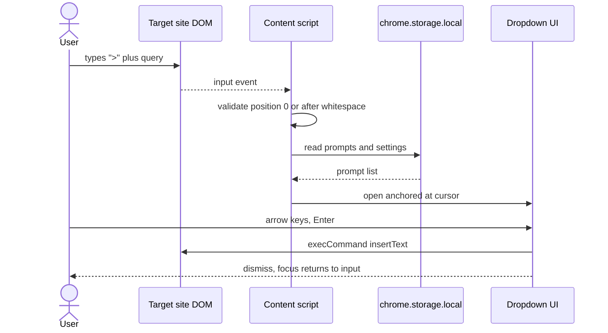
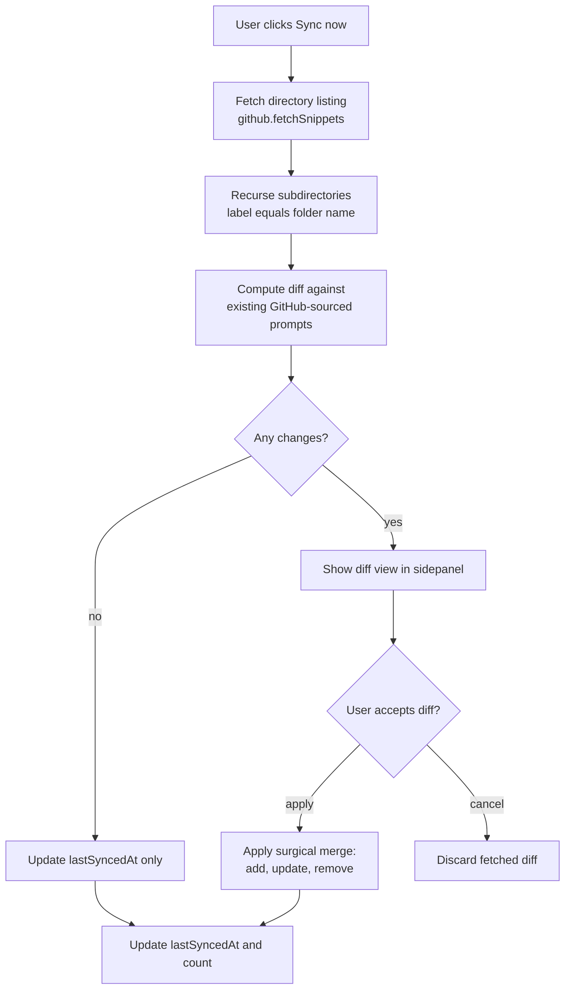
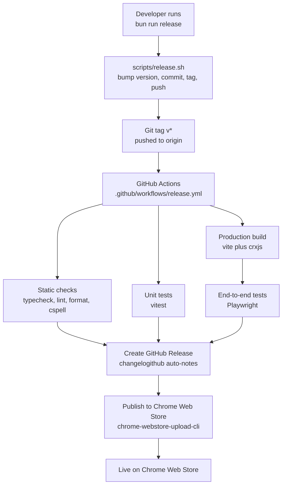

# Diagrams

Diagrams drawn from `.claude/ARCHITECTURE.md`, the per-domain entries under `.claude/context/`, and `.claude/REQUIREMENTS.md`. Update each section when its source prose changes shape, not after every refactor.

## Components

How the Chrome extension's four entry points share `src/shared/` and connect to Chrome APIs, target sites, and the GitHub API.

## Trigger and insertion

What happens between the user typing the trigger symbol and the chosen prompt landing in the chat input.

## GitHub sync pipeline

Read-only pull from a GitHub repo into the extension, with a manual diff review before changes land in storage.

## Release and deploy

Tag-driven release flow from the local script through GitHub Actions to the Chrome Web Store.

