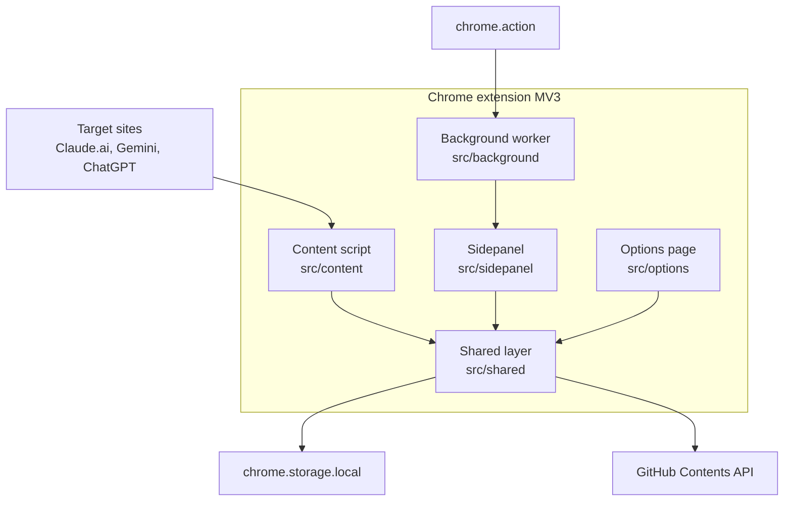

# Extension components

The extension runs four entry points inside one MV3 package. Each of them reads and writes prompts through `src/shared/`, which is the only module that reaches `chrome.storage.local`. The content script is the sole component injected into a target site, so the three chat hosts connect to it and to nothing else inside the extension.

Routing every storage access through one shared layer is what keeps the entry points agreeing with each other when a prompt changes in any of them. Letting each entry point own its own storage calls was rejected, because the sidepanel and the content script can sit open at the same time and would drift apart. The dotted edge marks the popup as dormant and kept for rollback. Open `src/shared/hooks` for the read path and `src/content/` for the injection side.
