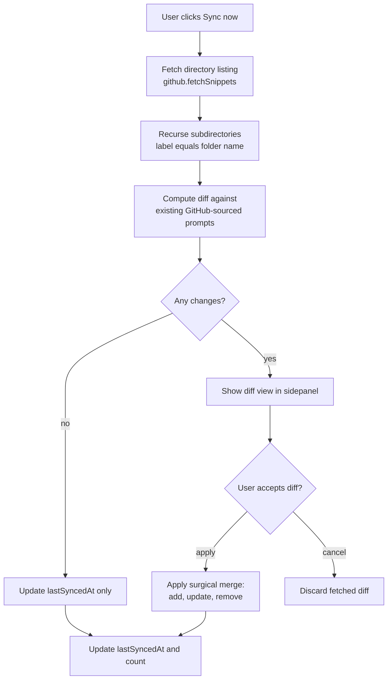

# GitHub sync pipeline

Sync pulls a directory listing from GitHub, walks any subdirectories it finds, and computes a diff against the prompts already marked as GitHub-sourced. Nothing is written to storage until the user has read that diff and accepted it.

The manual gate exists because the merge can remove prompts, and a silent apply would delete entries a user still wanted. A run that finds no changes skips the review and updates the timestamp on its own, which keeps a no-op sync from asking a question that has one answer. Sync never writes back to GitHub, so the remote stays the source of truth. Read `src/shared/utils` for the fetch path and `.claude/context/github-sync.md` for the three-way diff.
