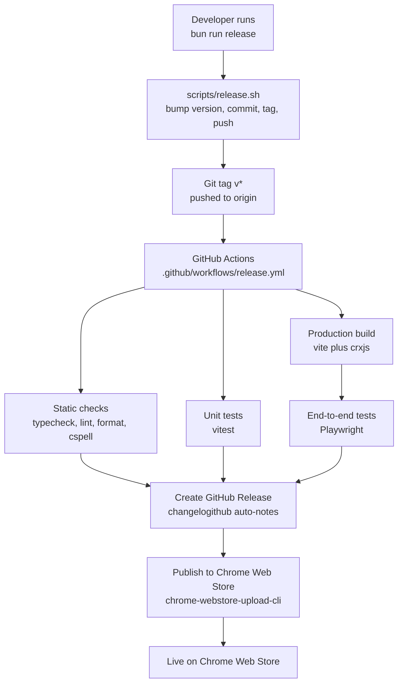

# Release and deploy

A release starts on a developer machine and finishes on the Chrome Web Store with no manual step in between. The local script bumps the version, commits, tags, and pushes, and the tag is what triggers the workflow. Pushing to a branch runs nothing here.

Static checks, unit tests, and the production build start together because none of them consumes another's output. End-to-end tests are the one job that waits, since Playwright drives the built extension and needs the build to finish first. All four feed the release step, so a red check stops the publish rather than shipping behind it. Read `scripts/release.sh` for the local half and `.github/workflows/release.yml` for the CI half.
