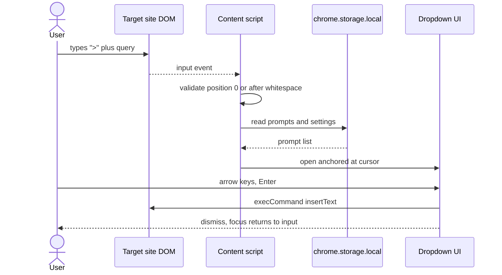

# Trigger to insertion

A prompt reaches the chat input through a sequence the content script drives from end to end. The user types the trigger symbol, the content script confirms the caret sits at position 0 or after whitespace, and only then does it read storage and open the dropdown.

The position check runs ahead of the storage read so a mid-word trigger character never costs a storage round trip. Insertion goes through `execCommand insertText` rather than assigning to the element's value, because the target sites run rich-text editors that discard a value set out from under them. Read `src/content/` for the per-site adapters and `.claude/context/trigger.md` for how each one detects its input element.
